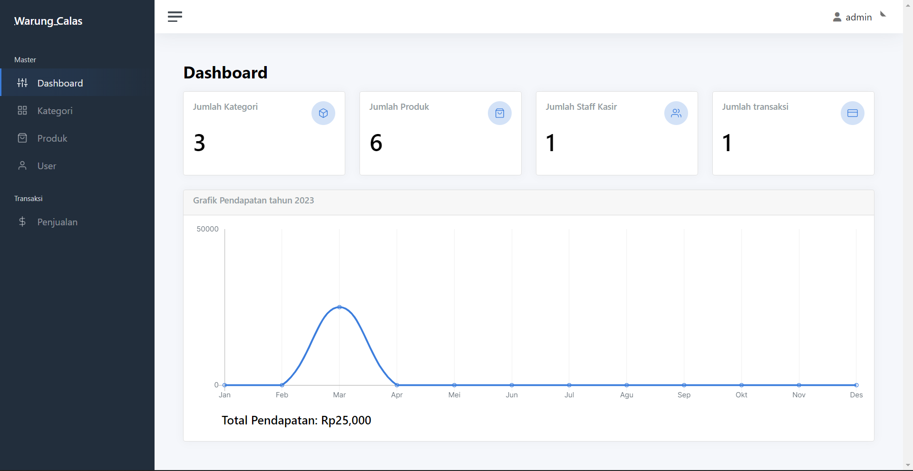
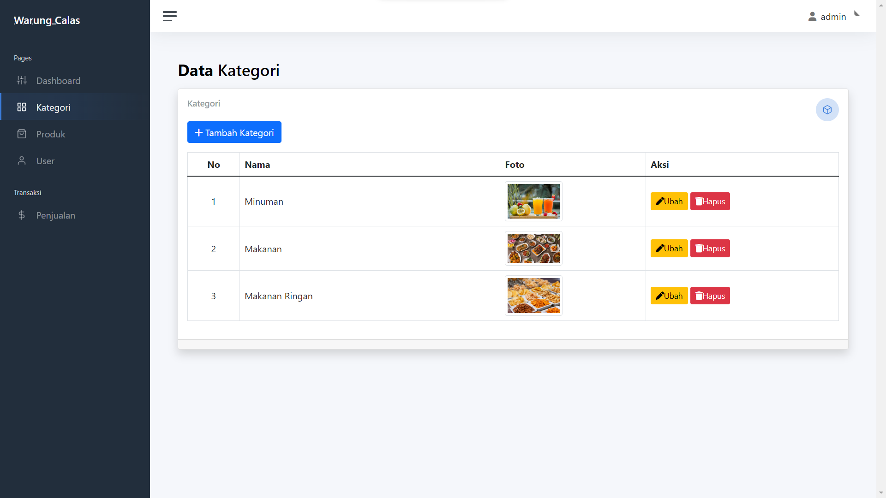
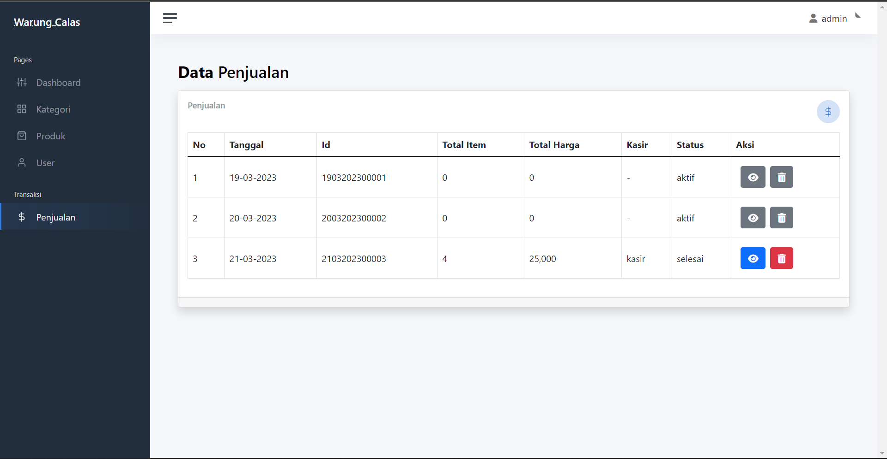

# Honesty
Web Point of Sale menggunakan framework laravel
<br>
framework yang digunakan `laravel` 
<br>
laravel: `9.52.4`

# Fitur
- Tambah;update;hapus;lihat data kategori, produk, dan kasir.
- Tampilan home untuk customer
- Tampilan Homepage untuk admin
- Tampilan Homepage untuk Kasir

# Screenshoot
<details>
    <summary>Foto Web</summary>
    <br>

|  |  |
| :---:  | :---:  |
|             |           
  |             
               |   
            |         
            |   


</details>  

# Cara install

#### Via Git
```bash
git clone https://github.com/komarkun/honesty-fix.git
```


### Setup Aplikasi
Jalankan perintah 
```bash
composer install --ignore-platform-reqs
```
Copy file .env dari .env.example
```bash
copy .env.example .env
```
Konfigurasi file .env
```bash
DB_CONNECTION=mysql
DB_HOST=127.0.0.1
DB_PORT=3306
DB_DATABASE=honesty_fix
DB_USERNAME=root
DB_PASSWORD=
```
Generate key
```bash
php artisan key:generate
```
Migrate database
```bash
php artisan migrate
```
Seeder table
```bash
php artisan db:seed
```

Update Composer
```bash
composer update
```

Menjalankan aplikasi
```bash
php artisan serve
```

username: admin
<br>
password: admin
<br>
<br>
username: kasir
<br>
kasir   : kasir

